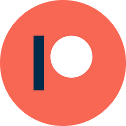

# Hi there  I'm Alexander Khyzhun

🚀 A modern Android Developer with 10-ish years of experience in software development on commercial projects. Being passionate about continuous learning, I quickly adapt to new libraries, conceptions, and programming languages. Able to create, elaborate, and neat UI based on modern design principles as well as concise, effective business logic.

<!--
My name is Alexander Khyzhun and I'm a software engineer from Ukraine. You can find me on [![Twitter][1.2]][1],  or on [![LinkedIn][3.2]][3].
-->

## &#x270d; Blog & Writing
Apart from coding, I try to express my thoughts and knowledge in my blog about Android & Kotlin. You can support me by following on [Medium][2] or [Patreon][3] to show that it ain't useless. Every article is collected into my channel in [Telegram][4] & [Twitter][1]

## 📬 Get in Touch

[][2]
[][1]
[][4]
[][5]
[][3]
[][8]
[][6]

<!-- ## &#x1f4c8; GitHub Stats

 -->

<!-- links to social media icons -->

<!-- icons with padding -->
[1.1]: http://i.imgur.com/tXSoThF.png (twitter icon with padding)
[2.1]: http://i.imgur.com/0o48UoR.png (github icon with padding)

<!-- icons without padding -->

[1.2]: http://i.imgur.com/wWzX9uB.png (twitter icon without padding)
[2.2]: http://i.imgur.com/9I6NRUm.png (github icon without padding)
[3.2]: https://raw.githubusercontent.com/MartinHeinz/MartinHeinz/master/linkedin-3-16.png (LinkedIn icon without padding)

<!-- links to your social media accounts -->

[1]: https://bit.ly/khyzhun_twitter (Twitter)
[2]: https://bit.ly/khyzhun_medium (Medium)
[3]: https://bit.ly/khyzhun_patreon (Patreon)
[4]: https://bit.ly/android2day (Telegram)
[5]: https://bit.ly/khyzhun_linkedin (LinkedIn)
[6]: https://bit.ly/kkkhyzhun (Instagram)
[7]: https://bit.ly/khyzhun_github (Github)
[8]: https://bit.ly/khyzhun_stackoverflow (StackOverflow)

<!-- Resources -->
<!-- Icons: https://simpleicons.org/ -->
<!-- GitHub Stats: https://github.com/anuraghazra/github-readme-stats -->
<!-- Emojis: https://emojipedia.org/emoji/ -->
<!-- HTML Emojis: https://www.fileformat.info/index.htm -->
<!-- Shields: https://shields.io/ -->
<!-- Awesome GitHub Profile README: https://github.com/abhisheknaiidu/awesome-github-profile-readme -->
